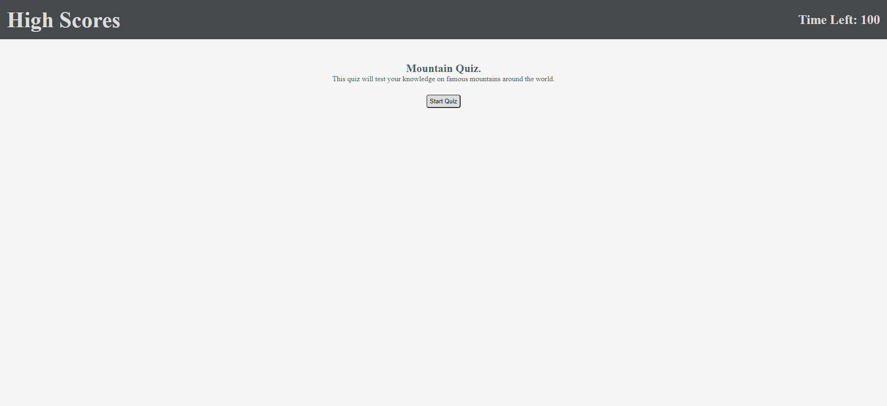
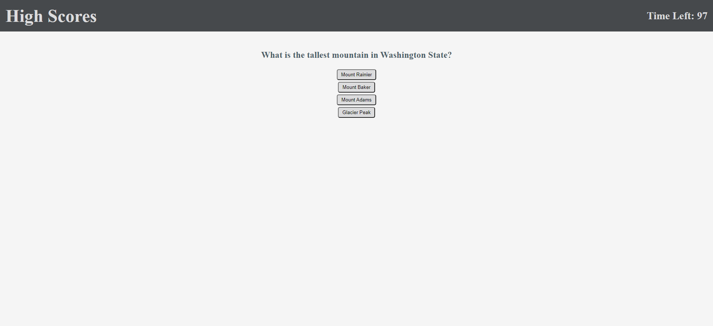
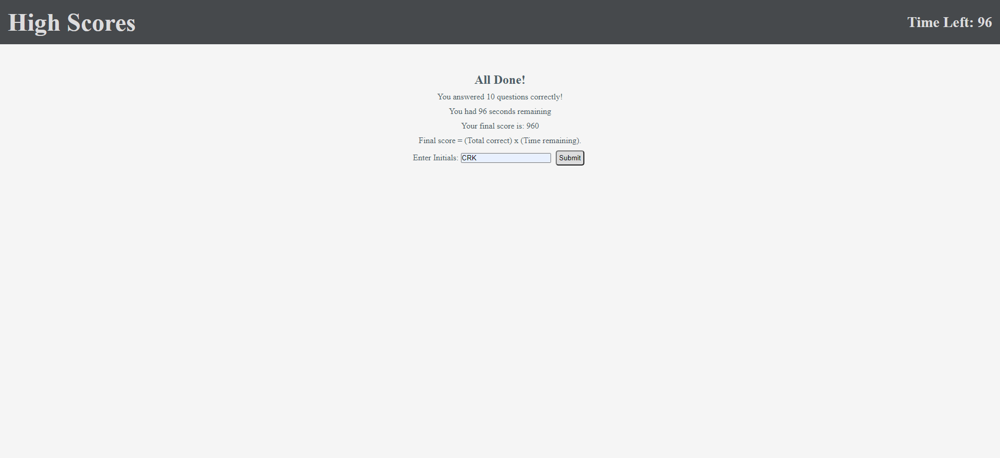

# Mountain Trivia Game

## Contributor - Chris Kimball

### Description
---------------
The following project is a web application that quizzes the user on mountain trivia. Users will have 100 seconds to answer 10 multiple choice questions about famous mountains. Answering a question will display feedback whether they answered the question correct or incorrect. Once the user has answered all 10 questions or 100 seconds have elapsed, then the user will be prompted to enter their initials and save their final score to a leaderboard that is stored between sessions.

The final score calculation that is saved to the leaderboard is the total number of questions answered correctly multiplied by the time remaining. If all 100 seconds have elapsed then the final score will equal the total number of correctly answered questions. This final score calculation will add an addtional way for users to increase their score by rewarding those who answer the questions quickly and correctly.

When a user views the leaderboard they will have the option to clear out the leaderboard which will remove all saved scores that are saved to local storage.

### Web addresses
---------------
*  [Deployed Website](https://chriskimball.github.io/trivia-4cr2an7f/ "Mountain Quiz")

*  [Github Repository](https://github.com/chriskimball/trivia-4cr2an7f/ "Github Repo")

### Installation
---------------
1. Clone this Git repository
2. Navigate to repository in local directory.
3. Open index.html on default web browser.

### Screenshot
---------------

